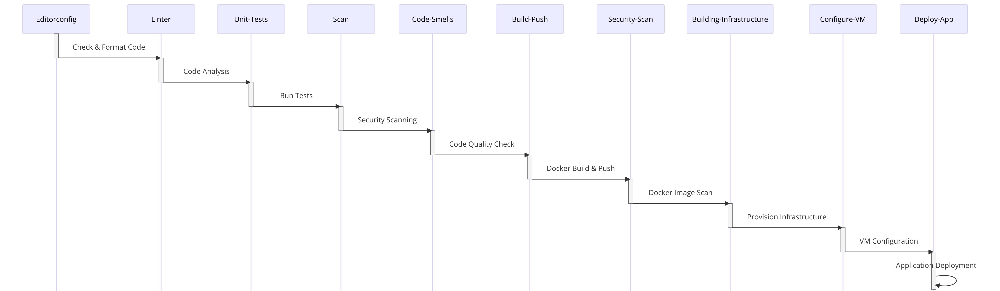

# Flask Microservices Application Overview

## Core Services

- **Frontend Service**: Interfaces with users, handling actions like login and data entry, all through Flask.

- **User Service**: Manages user accounts, authentication, and securely stores data using SQLite.

- **Data Service**: Responsible for storing and retrieving user data, also leveraging SQLite.

## System Design

- **Modular Architecture**: Each service focuses on specific functionalities for better scalability and maintenance.
- **Inter-service Communication**: Achieved via HTTP requests, promoting a decoupled yet cohesive structure.

# Running the Application Locally

## Prerequisites

Before you begin, ensure you have the following installed:
- Docker
- Docker Compose

## Steps to Run

1. **Clone the Repository**:
   Execute the following command to clone the project repository to your local machine:
   ```bash
   git clone https://github.com/GeorgiYovchev/f-project.git


2. **Navigate to the Project Directory**:
   Change into the project directory:
   ```bash
   cd f-project


3. **Run Docker Compose**:
   Start the application by running Docker Compose. This will build and start all the services defined in the `docker-compose.yml` file:
   ```bash
   docker-compose up

## Stopping the Application
1. **To stop the application, use the following Docker Compose command:**
   ```bash
   docker-compose down 

# CI/CD

In this section, we discuss the main CI/CD Pipeline for the Frontend service.



## Overview

## CI Key Components

The CI pipeline for the Frontend Service is defined in GitHub Actions. 
It is triggered on every push to specific paths in the repository, ensuring that the codebase is continuously integrated and tested.

- **Editorconfig Check**: Ensures the existence of `.editorconfig` to maintain code style consistency across the project.
- **Linter**: Incorporates `black` for Python linting, upholding code quality and standard formatting.
- **Unit Tests**: Executes unit tests to validate the correctness of code changes, ensuring reliability.
- **Security Scan (Gitleaks)**: Performs a scan for secrets and sensitive credentials within the codebase, enhancing security.
- **Code Smells Detection (SonarCloud)**: Analyzes the code for potential bugs and smells, aiding in maintaining clean, efficient code.
- **Build and Push**: Automates the building of the Docker image and pushes it to DockerHub, streamlining deployment.
- **Docker Image Security Scan (Trivy)**: Scans the Docker image for vulnerabilities, ensuring deployment security.
