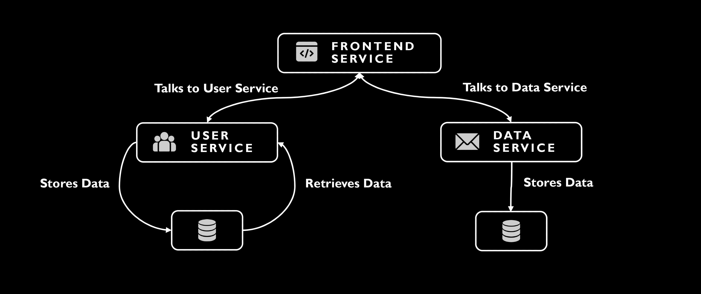

# Flask Microservices Application Overview

## Core Services

- **Frontend Service**: Interfaces with users, handling actions like register, login and data entry, all through Flask.

- **User Service**: Manages user accounts, authentication, and securely stores and retreives data using SQLite.

- **Data Service**: Responsible for storing data, also leveraging SQLite.

## System Design

- **Modular Architecture**: Each service focuses on specific functionalities for better scalability and maintenance.
- **Inter-service Communication**: Achieved via HTTP requests, promoting a decoupled yet cohesive structure.



# Running the Application Locally

## Prerequisites

Before you begin, ensure you have the following installed:
- Docker
- Docker Compose

## Steps to Run

1. **Clone the Repository**:
   Execute the following command to clone the project repository to your local machine:
   ```bash
   git clone https://github.com/GeorgiYovchev/f-project.git


2. **Navigate to the Project Directory**:
   ```bash
   cd f-project


3. **Run Docker Compose**:
   Start the application by running Docker Compose. This will build and start all the services defined in the `docker-compose.yml` file:
   ```bash
   docker-compose up

## Stopping the Application
1. **To stop the application, use the following Docker Compose command:**
   ```bash
   docker-compose down 

# CI/CD

In this section, we discuss the main [CI/CD Pipeline](.github/workflows/frontend_pipeline.yml) for the Frontend service.


## Overview

## CI Key Components

The CI pipeline for the Frontend Service is defined in GitHub Actions. 
It is triggered on every push to specific paths in the repository, ensuring that the codebase is continuously integrated and tested.

- **Editorconfig Check**: Ensures the existence of `.editorconfig` to maintain code style consistency across the project.
- **Linter**: Incorporates `black` for Python linting, upholding code quality and standard formatting.
- **Unit Tests**: Executes unit tests to validate the correctness of code changes, ensuring reliability.
- **Security Scan (Gitleaks)**: Performs a scan for secrets and sensitive credentials within the codebase, enhancing security.
- **Code Smells Detection (SonarCloud)**: Analyzes the code for potential bugs and smells, aiding in maintaining clean, efficient code.
- **Build and Push**: Automates the building of the Docker image and pushes it to DockerHub, streamlining deployment.
- **Docker Image Security Scan (Trivy)**: Scans the Docker image for vulnerabilities, ensuring deployment security.

## Continuous Deployment (CD) Components

## Overview

After the Continuous Integration (CI) process completes, including security testing and Docker image upload to Docker Hub, the workflow continues with Continuous Deployment (CD) pipeline. This pipeline consists of three primary stages: Building Infrastructure, Configuring the VM, and Deploying the Application.

## Stage 1: Building Infrastructure

The first stage of the CD process is crucial as it involves setting up the necessary infrastructure for the application. This process is automated using Terraform within the GitHub Actions workflow.

### GitHub Actions Workflow for Infrastructure

In this stage, the workflow performs several key actions:
- **Code Checkout**: Retrieves the latest codebase from the repository.
- **Terraform Setup**: Initializes Terraform with the specified version.
- **Infrastructure Creation**: Executes Terraform scripts to provision required infrastructure, such as cloud server.
- **Output Generation**: Outputs crucial information like the server IP address, which is used in subsequent stages.

### [Terraform Configuration](terraform)

The Terraform configuration in this stage is designed to set up and manage the cloud infrastructure. Key aspects include:
- **Version and Provider Specification**: Defines the required version of Terraform and configures cloud providers (like AWS and Hetzner Cloud).
- **State Management**: Configures backend for state management, ensuring consistent tracking of infrastructure changes.
- **Resource Definition and Allocation**: Creates cloud resource, such as virtual server as per the project requirements.
- **Output Information**: Provides essential details like server IP addresses for use in later stages of the pipeline.

## Stage 2: Configuring the VM

After the infrastructure is built using Terraform, the next step in our CD process involves configuring the virtual machine (VM) using Ansible. This process is handled by a specific job in the GitHub Actions workflow.

### GitHub Actions Workflow for VM Configuration

The workflow for configuring the VM includes the following steps:
- **Repository Checkout**: The latest version of the codebase is retrieved.
- **SSH Key Setup**: SSH keys are set up to facilitate secure access to the VM.
- **SSH Connection Test**: A test SSH connection is made to ensure proper configuration.
- **Ansible Playbook Execution**: Two main Ansible playbooks are executed. One for user creation and another for Kubernetes setup.

### Ansible Playbook: [User Creation and Setup](ansible/user-create.yml)

The first Ansible playbook focuses on creating a new user on the VM and setting up necessary permissions. Key tasks include:
- **Creating a New User**: A new user with sudo privileges is created.
- **SSH Directory and Keys Setup**: Ensures the SSH directory exists and copies the authorized keys for the new user.
- **Setting File Permissions**: Ensures correct permissions are set for the SSH directory and files.
- **Configuring Passwordless Sudo Access**: Allows the new user to execute commands without a password for simplicity and automation.

### Ansible Playbook: [Kubernetes Setup](ansible/kube-conf.yml)

The second playbook is responsible for setting up Kubernetes (k3s) on the VM. Major steps involve:
- **System Update and Upgrade**: Ensures all system packages are updated.
- **K3s Installation**: Checks if k3s is already installed and installs it if necessary.
- **Service Status Verification**: Ensures the k3s service is active and running.
- **Configuration File Permission Changes**: Adjusts permissions for the Kubernetes config file to be accessible by the new user.
- **Additional Package Installations**: Installs necessary packages like Python3-pip and Kubernetes tools.

## Stage 3: Deploying the Application

The final stage in our CD pipeline is the deployment of the application. This process is automated and orchestrated by GitHub Actions and Ansible.

### GitHub Actions Workflow for Application Deployment

The deployment job in GitHub Actions is configured as follows:
- **Prerequisites**: This job requires the completion of the building infrastructure, VM configuration, image build and push, and security scan stages.
- **SSH Setup**: Establishes an SSH connection to the configured VM.
- **Deployment Execution**: Runs an Ansible playbook to deploy the application to Kubernetes.

### Ansible Playbook: [Deployment to Kubernetes](ansible/deploy-frontend.yml)

The Ansible playbook for deploying the application involves several critical steps:
- **Creating Operations Folder**: Ensures a directory exists for Kubernetes manifest files.
- **Fetching Kubernetes Manifest**: Downloads the latest Kubernetes deployment manifest from the repository.
- **Updating the Image in Manifest**: Modifies the manifest to use the latest Docker image tag.
- **Applying the Kubernetes Manifest**: Applies the updated manifest to the Kubernetes cluster, effectively deploying or updating the application.

### Deployment Process

1. **Initial Setup**: GitHub Actions prepares the environment by setting up SSH keys and adding the server IP to known hosts.
2. **SSH Connection Test**: Verifies the SSH connection to the Kubernetes cluster.
3. **Running the Ansible Playbook**: Executes the playbook which performs the tasks of fetching, updating, and applying the Kubernetes manifest.

This deployment process ensures that the latest version of the frontend service is deployed to the Kubernetes cluster, making it accessible to end-users.

## Final Notes: User and Data Services

In addition to the automated pipeline for the frontend service, our application architecture includes two other critical components: the user service and the data service as mentioned in the beginning of the document. These services, while integral to the application's functionality, have a unique deployment process.

### User and Data Services Deployment

- **Manual Triggering**: The pipelines for both user and data services are configured to be manually triggered. This decision is based on the specific requirements and operational nuances of these services.
- **Purpose and Functionality**:
  - **User Service**: Manages user authentication, storing and retreiving data. Its deployment needs to be controlled and monitored closely due to the sensitivity of user data.
  - **Data Service**: Responsible for data storage. Given its critical role in data management, deployments require a careful and deliberate approach.

### Deployment Strategy

- **Selective Deployment**: Manual triggering allows for selective deployment, ensuring that updates to these services are rolled out in a controlled manner.
- **Similar Deployment Process**: Despite the manual trigger, these services follow a similar deployment process as the frontend service, involving infrastructure setup, VM configuration, and application deployment via Ansible playbooks.

### Rationale

- **Application Specificity**: The specific nature of the user and data services, particularly their roles in handling sensitive information, necessitates a more cautious deployment approach.
- **Controlled Updates**: Manual triggers allow for better control over when and how these services are updated, thereby reducing the risk of disruptions or data integrity issues.

---

If you would like to contribute to this project, or if you find any issues that you think need fixing, please refer to the [CONTRIBUTING](CONTRIBUTING.md) file.